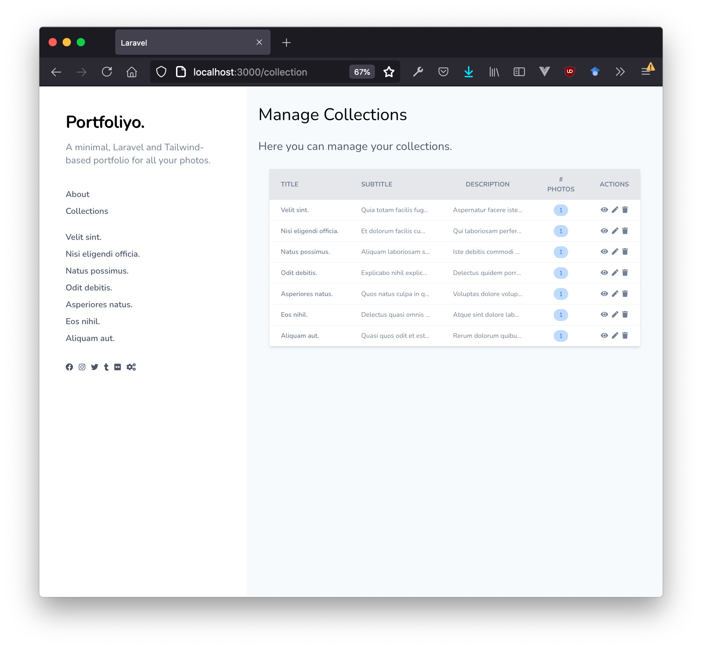

## Quickstart

`composer install`

`yarn install` or `npm install`

`php artisan serve`

## Enabling Authentication

Set the config property `ADMIN_KEY` in the `.env` file to enable authentication.
Example: `ADMIN_KEY=foo`
